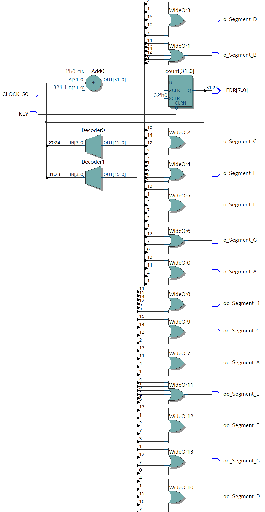

## My First FPGA Project

### Description
For my first project, I used the 50MHz clock to create a counter. To display the counter I used the 8 LEDs on the development board to represent the binary value of the counter for bits 24 - 31. I also displayed the counter value for bits 24 - 31 converted to hexadecimal on two 7 segment displays.

### Project Hardware
- TerasIC DE0-CV (Cyclone V)

### Pin Assignments
| Variable | I/O | Pin Assignment | I/O Bank | VREF Group | I/O Standard|
|----------|-----|----------------|----------|------------|-------------|
|`CLOCK_50`	    |Input	|PIN_M9	    |3B	|B3B_N0	|3.0-V LVTTL
|`KEY`	        |Input	|PIN_P22	  |5A	|B5A_N0	|2.5 V (default)
|`LEDR[7]`	    |Output	|PIN_U1	    |2A	|B2A_N0	|2.5 V
|`LEDR[6]`	    |Output	|PIN_U2	    |2A	|B2A_N0	|2.5 V
|`LEDR[5]`	    |Output	|PIN_N1	    |2A	|B2A_N0	|2.5 V
|`LEDR[4]`	    |Output	|PIN_N2	    |2A	|B2A_N0	|2.5 V
|`LEDR[3]`	    |Output	|PIN_Y3	    |2A	|B2A_N0	|2.5 V
|`LEDR[2]`	    |Output	|PIN_W2	    |2A	|B2A_N0	|2.5 V
|`LEDR[1]`	    |Output	|PIN_AA1	  |2A	|B2A_N0	|2.5 V
|`LEDR[0]`	    |Output	|PIN_AA2	  |2A	|B2A_N0	|2.5 V
|`o_Segment_A`	|Output	|PIN_U21	  |4A	|B4A_N0	|2.5 V
|`o_Segment_B`	|Output	|PIN_V21	  |4A	|B4A_N0	|2.5 V
|`o_Segment_C`	|Output	|PIN_W22	  |4A	|B4A_N0	|2.5 V
|`o_Segment_D`	|Output	|PIN_W21	  |4A	|B4A_N0	|2.5 V
|`o_Segment_E`	|Output	|PIN_Y22	  |4A	|B4A_N0	|2.5 V
|`o_Segment_F`	|Output	|PIN_Y21	  |4A	|B4A_N0	|2.5 V
|`o_Segment_G`	|Output	|PIN_AA22	  |4A	|B4A_N0	|2.5 V
|`oo_Segment_A`	|Output	|PIN_AA20	  |4A	|B4A_N0	|2.5 V
|`oo_Segment_B`	|Output	|PIN_AB20	  |4A	|B4A_N0	|2.5 V
|`oo_Segment_C`	|Output	|PIN_AA19	  |4A	|B4A_N0	|2.5 V
|`oo_Segment_D`	|Output	|PIN_AA18	  |4A	|B4A_N0	|2.5 V
|`oo_Segment_E`	|Output	|PIN_AB18	  |4A	|B4A_N0	|2.5 V
|`oo_Segment_F`	|Output	|PIN_AA17	  |4A	|B4A_N0	|2.5 V
|`oo_Segment_G`	|Output	|PIN_U22	  |4A	|B4A_N0	|2.5 V

### Gate Level Schematic
 